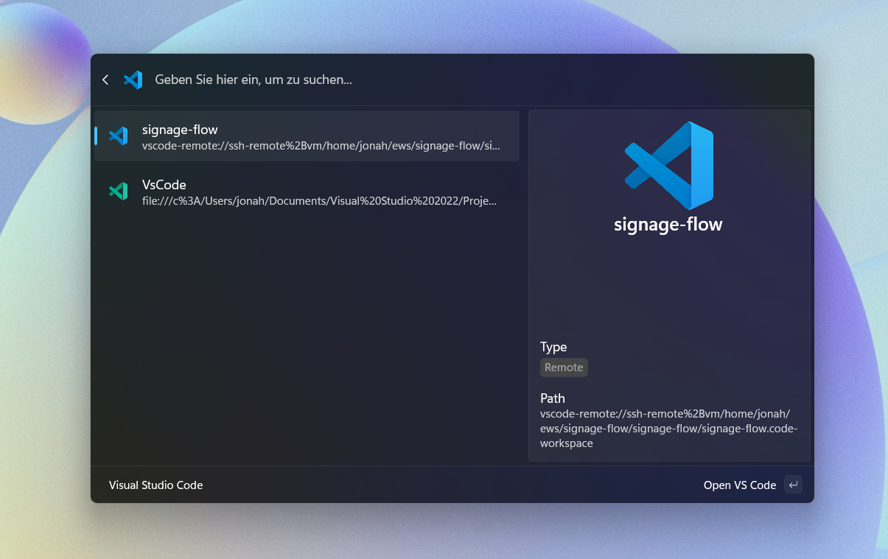

# Command Palette for Visual Studio Code

## Overview

This project provides a command palette extension for opening Visual Studio Code workspaces.



## Features

- **Workspace Management**: Retrieve and display a list of available workspaces, including their paths and types (e.g., Local, WSL, Remote).
- **Command Execution**: Open workspaces in Visual Studio Code using a dedicated command.
- **Multi-Installation Support**: Works for multiple installations of Visual Studio Code, including Insider and system installations.

## Installation

> [!NOTE]  
> Because the application is first signed by the Microsoft Store, updates will take a few days to be available via WinGet or in the Command Palette.

### Windows Store

<a href="https://apps.microsoft.com/detail/9PKCGVQ05TG1?mode=direct">
	
</a>

### Via Command Palette
1. Open Command Palette
2. Select "Command Palette - VS Code"

### Via Winget
1. Open Command Prompt or PowerShell
2. Run the following command:
   ```bash
   winget install JonahFintzDEV.CommandPalette-VSCode
   ```

### Manual Installation

1. Make sure you use the latest version of PowerToys.
2. Install the application by double-clicking the `.msix` file.

## Settings

- **Preferred Edition**: Determines which edition (Default or Insider) is used when a folder or workspace has been opened in both editions of VS Code.
- **Use Strict Search**: Enables or disables strict search for workspaces.  
  - **Strict Search**: Matches items where the search text appears as a contiguous substring in the item's title or subtitle. For example, searching for "abc" will match "abc" or "abc123" but not "a1b2c3".
- **Show Details Panel**: Toggles the visibility of the details panel in the UI.
- **Tag Type**: Configures the tags displayed for each workspace.  
  - Options:  
    - **None**: No tags are displayed.  
    - **Type**: Displays the workspace type (e.g., Local, WSL, Remote).  
    - **Target**: Displays the target instance name (e.g., VS Code, VS Code Insider).  
    - **Type & Target**: Displays both the workspace type and the target instance name.

## Contributing

Contributions are welcome! If you have suggestions for improvements or new features, please open an issue or submit a pull request.
